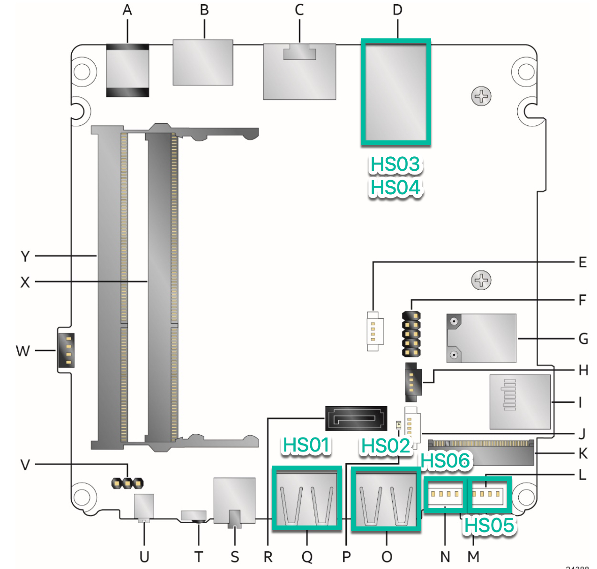

Jump to [Explain BIOS](./config_explain_BIOS.md)

## NUC8 Hardware Info

***Physical View***

***USB Physical Mapping*** for each port identified in the bios

Physical Port (Bios naming) | Logical Port | Comment
--------------|--------------|--------
Front 1       | HS01         | Front panel USB 3.1 connector (orange, charging)
Front_2       | HS02         | Front panel USB 3.1 connector (blue)
Rear_3        | HS03         | USB 3.1 ports (blue)
Rear_4        | HS04         | USB 3.1 ports (blue)
Internal_5    | HS05         | Front panel single-port USB 2.0 header (1.25 mm pitch)
Internal_6    | HS06         | Front panel single-port USB 2.0 header (1.25 mm pitch)
xxxxxxx       | HS07         | xxxxxxx
xxxxxxx       | HS08         | xxxxxxx
xxxxxxx       | HS09         | xxxxxxx
xxxxxxx       | HS010        | xxxxxxx
xxxxxxx       | HS011        | xxxxxxx
xxxxxxx       | HS012        | xxxxxxx
xxxxxxx       | HS013        | xxxxxxx
xxxxxxx       | HS014        | xxxxxxx
