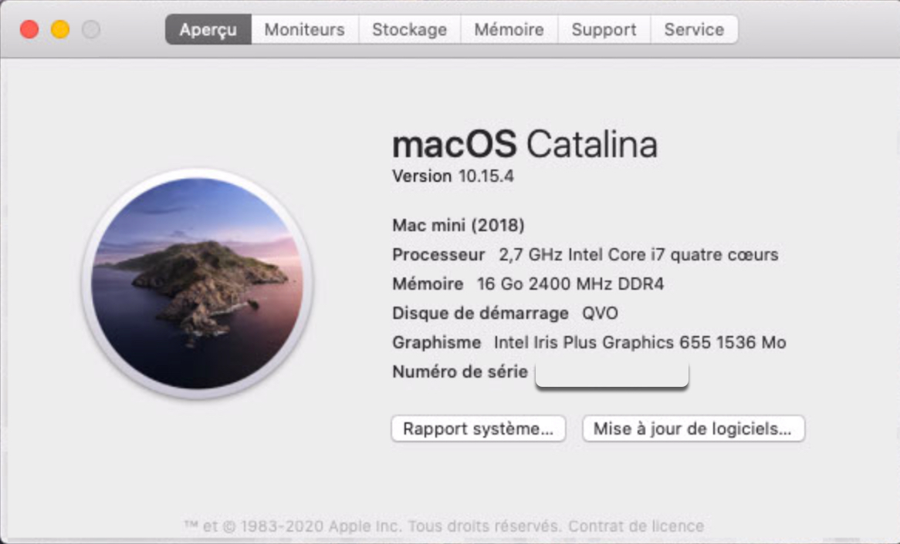

# NUC8I7BEH-Hack

Inspiration by [Hackintosh / Vanilla](https://hackintosh.gitbook.io/-r-hackintosh-vanilla-desktop-guide/) & [[GUIDE] Installing macOS Mojave (10.14.x) on Intel NUC8i7BEH using Clover UEFI](https://github.com/sarkrui/NUC8i7BEH-Hackintosh-Build) & [Hackintosh NUC8I5BEH - 黑苹果 - OpenCore & Clover](https://github.com/csrutil/NUC8I5BEH)

Sections:

 * Jump to [Hardware](./Hardware.md)
 	* Jump to [Explain BIOS](./config_explain_BIOS.md)
 * Jump to [Software](./Software.md)
 	* Jump to [Explain ACPI](./config_explain_ACPI.md)
 	* Jump to [Explain SSDT USB](./config_ssdt_usb.md)
 * Jump to [Benchmark](./benchmark.md)

## Parts List

[PCPartPicker Part List](https://fr.pcpartpicker.com/list/NDrLf9)

Type|Item
:----|:----
**Memory** | [G.Skill Ripjaws Series 16 GB (2 x 8 GB) DDR4-2400 Memory](https://fr.pcpartpicker.com/product/xz7CmG/gskill-memory-f42400c16d16grs)
**Storage** | [Samsung 860 QVO 1 TB 2.5" Solid State Drive](https://fr.pcpartpicker.com/product/vRWfrH/samsung-860-qvo-1-tb-25-solid-state-drive-mz-76q1t0bw)
**Custom** | NUC8I7BEH2
**Custom** | Airport Bcm94360Cs2 from Macbook Air A1465 on a WiFi Bluetooth 4.0 Wireless Card to PCI-E Adapter with External Antenna

### Working
---

* No MSR 0xE2 on NUC8 Series

* Catalina install boots successfully
* APFS - Sata Samsung QVO
* iGPU UHD 655
* Wired Ethernet - Intel I219-V PCI Express Gigabit Ethernet
* Wireless Ethernet / Wifi - Airport A1465 (Bcm94360Cs2)
* Bluetooth - Airport A1465 (Bcm94360Cs2)
* Apple Bluetooth WakeUp
* Audio - Select internal speakers
* Rear and Front audio jacks
* USB 2.0
* Apple Superdrive USB 2.0
* USB 3.1 and USB C
* Sleep/Wake

### Not Working
---

### Being finalized
---
* Overall optimization
* Quicklook
* Youtube video
* Netflix with Chrome and Safari
* H.264 videos via VLC (.mkv, .m4a, .m4p)
* HWMonitor
* AirPlay
* Handoff & Continuity
* Facetime
* Itunes
* Apple Store
* Nightshift

### Tools
* [Clover Configurator](https://mackie100projects.altervista.org/download-clover-configurator/)
* [Hackintoosh](http://headsoft.com.au/download/mac/Hackintool.zip)
* [Intel Power Gadget](https://software.intel.com/en-us/articles/intel-power-gadget)
* [LG 4K Dolby Trailer](https://drive.google.com/uc?export=download&id=1Fr_pI7uadSs9K99WFrJx2-1m8GwcC1R9)
* [MacIASL](http://sourceforge.net/projects/maciasl)
* [VideoProc](https://www.videoproc.com/) - Chech UHD Hardware Acceleration
* [OpenCore Sanity Checker](https://opencore.slowgeek.com)
