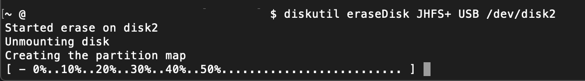
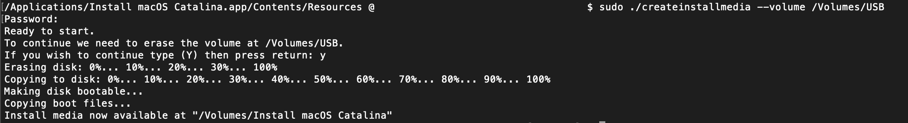

# Software

---
Setup for a MacMini 8,1 with OpenCore v057

Catalina version 10.15.4

* Jump to [Explain ACPI](./config_explain_ACPI.md)
* Jump to [Explain BOOT](./config_explain_BOOT.md)
* Jump to [Explain DEVICES](./config_explain_DEVICES.md)
* Jump to [Explain Kernel And Kext Patches](./config_explain_KandKexTPatches.md)
* Jump to [Explain SSDT USB](./config_ssdt_usb.md)


## Create macOS Installation

macOS Mojave version 10.15.4
* Format USB (minimum 8 GB) `diskutil eraseDisk JHFS+ USB /dev/disk#`
> The above command was required for a USB drive which did not have an EFI partition, not created with the GUID partition scheme. The option to create the GUID partition scheme was not in the Mojave Disk Utility GUI.



* Create a macOS USB installer `sudo /Applications/Install\ macOS\ Catalina.app/Contents/Resources/createinstallmedia --volume /Volumes/USB`



* Install OpenCore to USB installer
* Copy EFI folder to the EFI partition

## Installing OpenCore

Using OpenCore version 057

_Under Drivers (Recommanded / FileSystem / Memory Fix / Additional) choose:_

* _ApfsDriverLoader.efi_ - This allows OpenCore to see and boot from APFS volumes by loading apfs.efi from ApfsContainer located on block device
* _VBoxHfs.efi_ - Apple official driver for HFS Plus
* _FwRuntimeServices.efi_ - Required


## Config.plist

```markup


```

## OpenCore Files

Kext | Usage
--- | ---
AppleALC.kext | Audio
VirtualSMC.kext | Required
FakePCIID.kext | Enhanced compatibility
FakePCIID_Intel_HDMI_Audio.kext | Enhanced compatibility
SMCProcessor.kext | Metrics
SMCSuperIO.kext | Metrics
IntelMausi.kext | Ethernet
Lilu.kext | Audio + Graphics
WhateverGreen | Graphics
